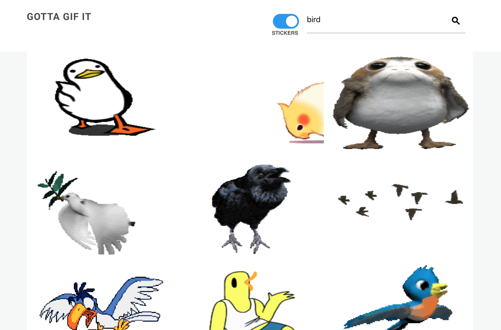
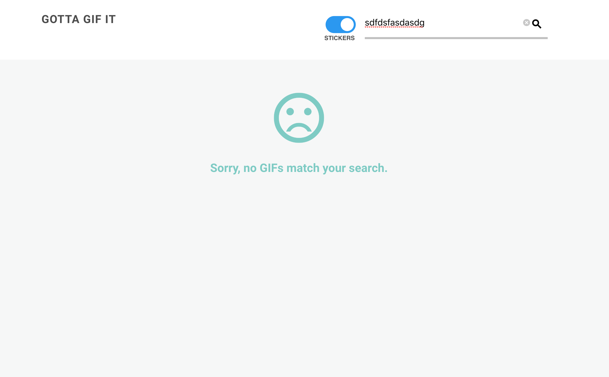

# Gotta Gif It
##### Project from Treehouse's [Data Fetching in React](https://teamtreehouse.com/library/data-fetching-in-react) by Guil Hernandez

#### Introduction

**Title**: Gotta Gif It

by Steve Hanlon

*Gotta Gif It* is a web app that displays animated GIFs and GIF Stickers supplied by [Giphy.com's API](https://developers.giphy.com/)

An API get request is made using [Axios](https://github.com/axios/axios) to return 24 GIFs that match the search query provided by the user.

The **Search** interface has a search input at top which is used to retrieve search results via the Giphy API call.  It then displays all images. I've implemented [w3schools toggle switch](https://www.w3schools.com/howto/howto_css_switch.asp) which sets the Request URL to GIFs or Stickers.  

[Click here to see the component and data break down of the app.](#picture-of-data-and-components-breakdown)

[Click here to see pictures of the website's Responsive Design.](#pictures-of-responsive-design)

##### Start-up Server

To run the server, NPM or Yarn must be installed.

Open up the terminal and go to the project directory.  Inside of the project directory, run:

`npm install`

`npm start`

If you have Yarn installed run:

`yarn start`

This project was built using *Create React App*.  For complete technical details click [Create React App](./docs/README.md)

##### Technical Components
- CSS Grid, Flexbox and Media Queries used to build the _responsive features_.
- JavaScript (ECMASript 6)
- React 16.5.2

##### Articles and Tutorials

Tutorials, articles and docs used while building this app.

- [Data Fetching in React](https://teamtreehouse.com/library/data-fetching-in-react) by Guil Hernandez
- [w3schools toggle switch](https://www.w3schools.com/howto/howto_css_switch.asp)

#### Picture of Data and Components Breakdown

#### Pictures of UI
##### Phone

##### Tablet

##### Desktop

### Future Features
-
